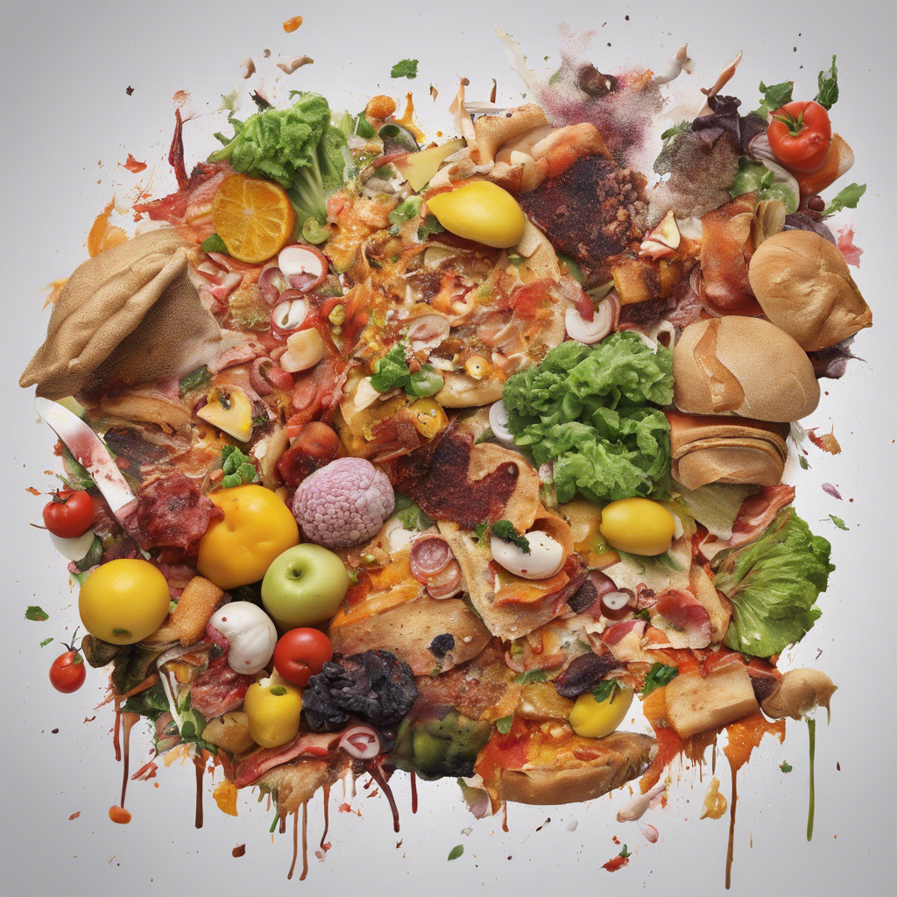

# World Food Production Analysis

(Fot of some food created by Federico Trotta with AI)

In this project I've analyzed world food production, understanding the emissions for producing certain kinds of food.

I found the most produced products and the most polluting, in certain world areas.
Also, I've compared these results with the trend of the population and with the food waste, making some reasonings.

If you are interested in the code, for a better visualization (due to the library "Plotly") you may even take a look at the project on my Kaggle account [here](https://www.kaggle.com/code/federicotrotta/world-food-production-analysis)

## The main ideas behind this project
If you are not "a technician" or if you just want to understand the main concepts without reading the code, you can take a look at the PDF I created:

- [here](https://github.com/federico-trotta/World-Food-Analysis/blob/main/PDF/ITALIAN/Analisi%20della%20produzione%20mondiale%20di%20cibo.pdf) you find the Italian version
- [here](https://github.com/federico-trotta/World-Food-Analysis/blob/main/PDF/ENGLISH/World%20food%20production%20analysis.pdf) you find the English version

## About Federico Trotta

Hi, my name is Federico Trotta and I am a freelance Technical Writer.

Do you want to collaborate with me? [Contact me to hire me](https://bio.link/federicotrotta)!